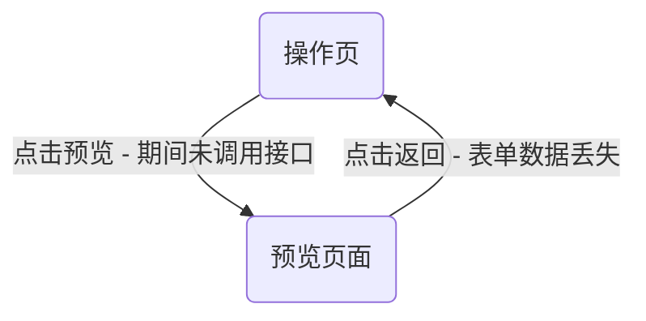

# 解决路由跳转后数据丢失的问题

最近遇到的一个需求，在操作页点击预览，跳转到预览页面，但是期间并没有调接口，在预览页面点击返回，操作页的数据自然而然的丢失了。



这个问题其实非常的简单，但是不妨找找最优的解法

- 数据持久化，在操作页点击预览时，将数据存储到本地，返回时从本地获取数据
- 使用keep-alive缓存路由，预览页面不需要缓存，操作页需要缓存

## 首先我们修改 路由的元数据

```json
{
  "meta": {
    "title": "公告编辑",
    "icon": "heimingdanguanli",
    "hideMenu": true,
    "backgroundColor": "rgb(240, 242, 245)",
    "keepAlive": true
  }
}
```

## 然后修改app.vue中的内容

```vue
<script lang="ts" setup>
import { useRoute } from '@yhdfe-plugins/portal-cms-vue'

const route = useRoute()
</script>

<template>
  <router-view v-slot="{ Component }">
    <keep-alive>
      <component :is="Component" v-if="route.meta.keepAlive" :key="route.name" />
    </keep-alive>
    <component :is="Component" v-if="!route.meta.keepAlive" :key="route.name" />
  </router-view>
</template>
```

## 现在就可以将指定的路由缓存起来了

## 再次增强

<!-- ###  -->
